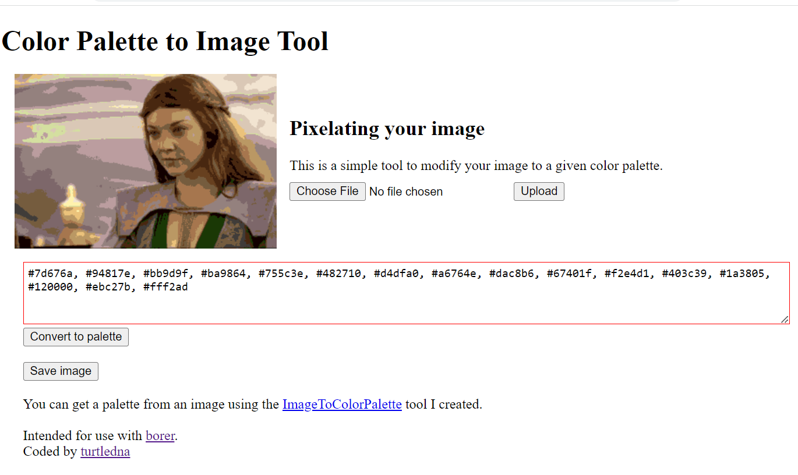

# Color Palette To Image v1.0
Given a color palette, transfers the colors to an image using the nearest color method, creating a pixelated image. Javascript and HTML.

I created this for use with [Borer](http://github.com/turtledna/borer) to reduce the colors in an image so that the colors themselves can map as indexes into a codex (a small library of functions). Borer is an example of sequenced programming using turtle functions and sequences to read and alter data including images.
See http://turtledna.neocities.org/colorpalettetoimage/index.html for a working demo.

# To run
Download and extract first, then run index.html on Apache server or http://localhost. Built using Chrome.
